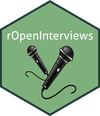

# rOpenInterviews 

### .rprofile Interviews

[.rprofile interviews available on rOpenSci blog](https://ropensci.org/tags/rprofile/)

[Unconf17 project description](https://github.com/ropensci/unconf17/issues/64)

### .renviron Interviews

[Unconf18 project description](https://github.com/ropensci/unconf18/issues/70)

.Renviron Interviews focus less on personal career/life topics and more on personal workflows/demos. If you have a process or package or R-related life skill that you're highly opinionated about, I think it would make an awesome .Renviron piece. I'm imagining the process would go something like:

    An interviewer and interviewee sit together in front of a computer.
    They turn screen capture on.
    They turn audio recording on.
    The interviewee shows the interviewer how to do something or use something, using their favorite tools, workflow and opinionated development practices.
    The interviewer asks questions about what's going on.
    The interviewer transcribes and edits the audio into written form, and selectively chooses pieces of the recorded screen capture to edit into short GIFs.
    The interviewee makes their own edits or suggestions.
    You have an awesome .Renviron!

### Call to Contribute!

Are you interested in interviewing? Being interviewed? Do you have cool ideas for this project? Get in touch by creating an issue or reaching out to Kelly on twitter [@kellrstats](https://twitter.com/kellrstats)
